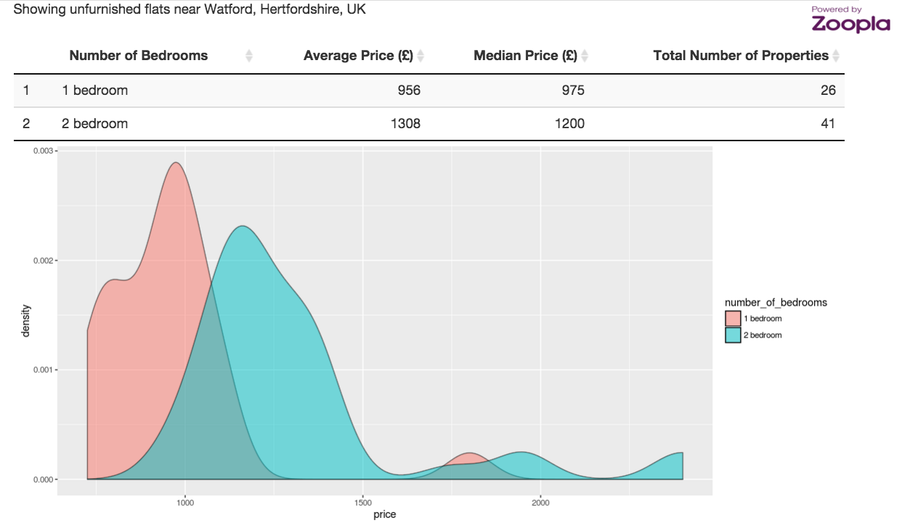

## Introduction

- Have you been offered a job in London or thinking of moving there?  

- Wondering if you can afford it or if the commute will be too long?

- Well this app combines API data from the property site [zoopla.co.uk](http://www.zoopla.co.uk) and Google Maps to help you quickly find and explore the ideal suburb that balances rental prices with commuting transit times.

---

## Finding Rental Properties 


- We only consider rental accomodation and the options available to you are: area interested in, search radius, price range, property type, and the number of bedrooms. 

-  The default location is 'Watford, England', but this can of course be changed to any area/town/village/postcode within the UK. 

- Once you're ready, just click on `Fetch Properties` buttons to display your results.

---

## Property Results




```{r googlemap, echo=FALSE, results = 'asis'}
require(googleVis)
load("stations.Rda")
M<-gvisMap(df, "link" , "propertylink", options=list(showTip=TRUE,
                                                     showLine=TRUE,
                                                     enableScrollWheel=TRUE,
                                                     mapType='normal', 
                                                     width=450, height=270))
print(M,"chart")
```


- Returns up to 100 properties from [zoopla](http://www.zoopla.co.uk). 

- We compute the average and median prices  and show the distributions.

- And use the `googleVis` library to show the locations of each property. Click on one of the properties in the above Google Map. [note: the map may not be displaying properly in Chrome browser -it seems to be a bit glitchy. On  a Mac try safari. If still not displaying try refreshing the slide. - sorry]

---

## Transit times


- Once you are happy with your property results, the app will take your entered location and use it to compute train transit times via Google Maps API. 

- Simply enter your desired destination  e.g. this might be the place of work. 

- Then, enter a search radius 

- And finally a departure time. Default is set to roughly a rush hour time and the date set to todays.

- The app will then return a list of stations within yoru search radius followed by transit times.

- Future versions of this app will include a lot more information such as: monthly commuting costs, and other outgoings set against your salary.

---
