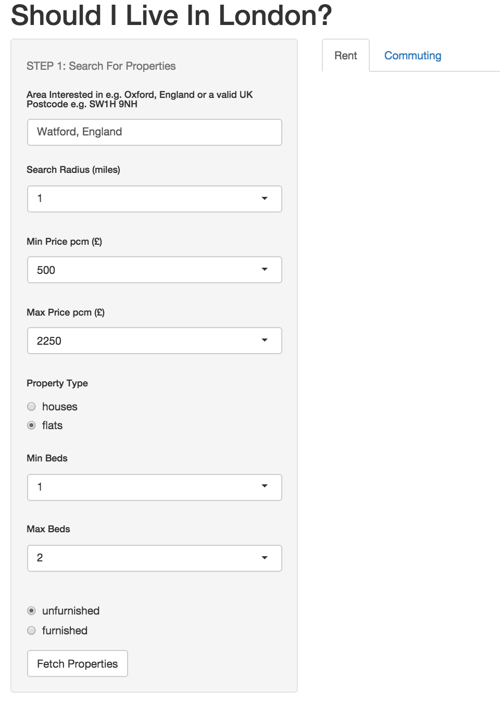

<style>
strong {
  font-weight: bold;
}
</style>
## Introduction

- Have you been offered a job in London or thinking of moving there?  

- Wondering if you can afford it or if the commute will be too long?

- Well this app combines API data from the property site [zoopla.co.uk](http://www.zoopla.co.uk) and Google Maps to help you quickly find and explore the ideal suburb that balances rental prices with commuting transit times.

---

## Finding Rental Properties 


- We only consider rental accomodation with options such as: area interested in, search radius, price range, property type, and the number of bedrooms, availble to you.

- We have set the default location to 'Watford, England' as a demo,  but this can of course be changed to any area/town/village/postcode within the UK. [N.B. We use Google geocode API to try and return an accurate address]


- Once you're ready, just click on `Fetch Properties` buttons to display your results.

- The app should warn you if no properties have been found within your search criterion. This usually means you should increase your search radius and/or your maximum price threshold.


---  .codefont 

## Property Results


```{r googlemap, echo=T, results = 'asis'}
require(googleVis)
load("stations.Rda")
M<-gvisMap(df, "link" , "propertylink", options=list(showTip=TRUE,enableScrollWheel=TRUE,mapType='normal',width=450, height=270))
print(M,"chart")
```

- Returns up to 100 properties from [zoopla](http://www.zoopla.co.uk) and we compute the average and median prices  and show the distributions.

- The `googleVis` library shows the locations of each property. Click on one of the properties in the above map. [<strong>note: refresh your browser if map above  is not displaying properly.</strong>]

---

## Transit times


- Once you are happy with your property results, the app will take your entered location and use it for computing train transit times via Google Maps API. 

- Simply enter your desired destination  e.g. this might be the place of work. 

- Enter a search radius and finally select a departure time. Default is set to roughly a rush hour time with the date always set to 'todays' date.

- The app will then return a list of stations within your search radius followed by transit times.

- Future versions of this app will include a lot more information such as: monthly commuting costs, and other outgoings which you can set against your expected salary.

